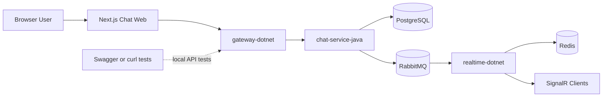
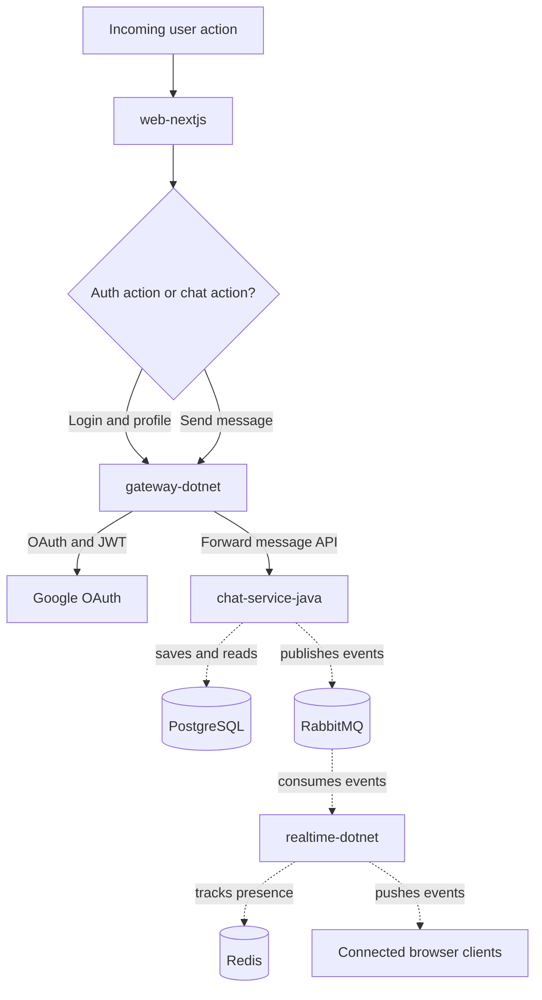
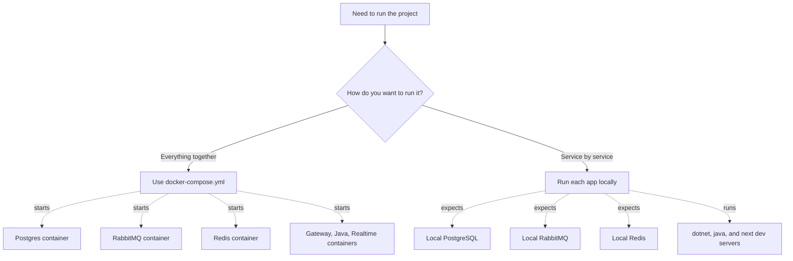
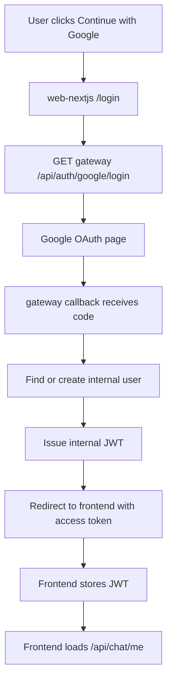
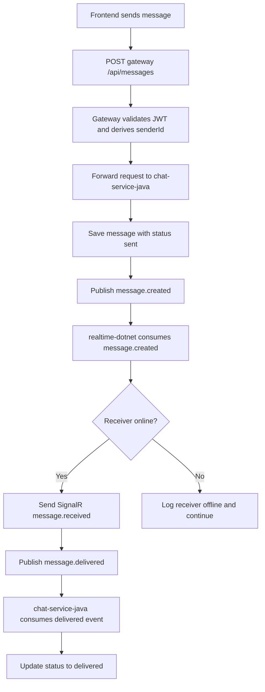
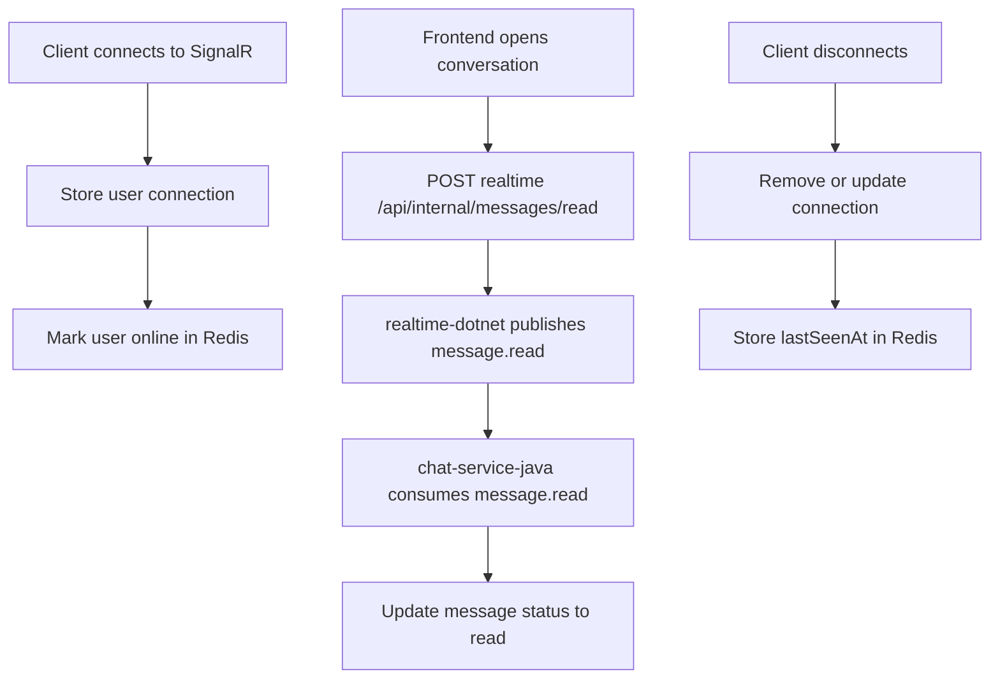

# Distributed Chat System

Sistem ini adalah implementasi chat terdistribusi berbasis multi-service yang dibangun bertahap dengan fokus pada:

- autentikasi Google OAuth + JWT
- API gateway
- persistence message
- realtime delivery
- event-driven status update
- online presence
- rate limiting
- web chat UI
- local container orchestration dengan Docker Compose

Project root ini berisi 4 aplikasi utama:

- `gateway-dotnet`
- `chat-service-java`
- `realtime-dotnet`
- `web-nextjs`

serta 3 komponen infrastructure:

- PostgreSQL
- RabbitMQ
- Redis

## Table of Contents

- [1. What We Built](#1-what-we-built)
- [2. Repository Structure](#2-repository-structure)
- [3. Architecture Overview](#3-architecture-overview)
- [4. End-to-End Message Flow](#4-end-to-end-message-flow)
- [5. Service Details](#5-service-details)
- [6. Frontend Pages](#6-frontend-pages)
- [7. API Reference](#7-api-reference)
- [8. RabbitMQ Events](#8-rabbitmq-events)
- [9. Redis Usage](#9-redis-usage)
- [10. Local Run Without Docker](#10-local-run-without-docker)
- [11. Run Full Stack With Docker Compose](#11-run-full-stack-with-docker-compose)
- [12. End-to-End Testing Guide](#12-end-to-end-testing-guide)
- [13. Environment Variables](#13-environment-variables)
- [14. Notes and Current Limitations](#14-notes-and-current-limitations)

## 1. What We Built

Berikut kemampuan yang saat ini sudah ada di repository ini.

### Authentication and gateway

- `gateway-dotnet` menyediakan Google OAuth login.
- Setelah login sukses, gateway membuat internal user di PostgreSQL jika belum ada.
- Gateway menerbitkan internal JWT token untuk dipakai service lain dan frontend.
- Endpoint `/api/me` tersedia untuk membaca profil user login.
- Endpoint `/api/users` tersedia untuk mengambil user directory internal yang sudah pernah login.

### Messaging and persistence

- `chat-service-java` menyimpan message ke PostgreSQL.
- Endpoint create message tersedia di `POST /api/messages`.
- Endpoint conversation history tersedia di `GET /api/messages/conversation/{conversationId}`.
- Message awalnya disimpan dengan status `sent`.

### Realtime delivery

- `realtime-dotnet` menyediakan SignalR hub di `/hubs/chat`.
- Client SignalR memakai JWT token.
- Realtime service menyimpan mapping koneksi user.
- Pesan yang masuk lewat RabbitMQ akan didorong ke user online via SignalR event `message.received`.

### Event-driven status updates

- `chat-service-java` publish event `message.created` setelah message berhasil disimpan.
- `realtime-dotnet` consume `message.created`, lalu push ke receiver jika online.
- Jika push realtime sukses, `realtime-dotnet` publish `message.delivered`.
- `chat-service-java` consume `message.delivered`, lalu update status message menjadi `delivered`.
- Saat frontend menandai pesan sebagai dibaca, `realtime-dotnet` publish `message.read`.
- `chat-service-java` consume `message.read`, lalu update status message menjadi `read`.

### Presence and protection

- `realtime-dotnet` menyimpan online presence ke Redis.
- Endpoint `/api/presence/{userId}` tersedia untuk membaca status online user.
- `gateway-dotnet` menerapkan rate limit ke `POST /api/messages`.

### Frontend

- `web-nextjs` menyediakan login page, contacts page, dan chat page.
- Frontend memakai Google login melalui gateway.
- Frontend memakai Next.js route handlers sebagai server-side proxy ke backend.
- Frontend menampilkan:
  - daftar chat
  - follow contacts
  - presence
  - send message
  - message status `sent`, `delivered`, `read`

## 2. Repository Structure

```text
.
|-- chat-service-java/
|-- docker/
|   `-- postgres/
|       `-- init/
|           `-- 01-create-databases.sql
|-- gateway-dotnet/
|-- realtime-dotnet/
|-- web-nextjs/
|-- .env
|-- .env.example
|-- .gitignore
|-- docker-compose.yml
`-- README.md
```

### Main folders

- `gateway-dotnet/`
  .NET 8 API Gateway untuk auth, user profile, user directory, message proxy, dan rate limiting.

- `chat-service-java/`
  Spring Boot service untuk persistence message dan consumer/publisher RabbitMQ.

- `realtime-dotnet/`
  .NET 8 SignalR service untuk realtime delivery, presence, RabbitMQ consumer, dan event publisher.

- `web-nextjs/`
  Frontend chat berbasis Next.js App Router.

- `docker/`
  Init SQL PostgreSQL untuk database lokal Docker.

## 3. Architecture Overview

### High-Level View



### Request Flow



### Local vs Docker Mode



## 4. End-to-End Message Flow

### OAuth Flow



### Message Delivery Flow



### Read and Presence Flow



## 5. Service Details

## 5.1 gateway-dotnet

Technology:

- .NET 8
- ASP.NET Core Web API
- Entity Framework Core
- PostgreSQL
- Google OAuth
- JWT Bearer Auth
- Redis

Main responsibilities:

- login with Google
- issue internal JWT token
- create/find internal user
- return current user info
- return internal user list
- proxy message create/history to Java service
- apply rate limiting on message creation

Important controllers:

- `Controllers/AuthController.cs`
- `Controllers/AccountController.cs`
- `Controllers/MessagesController.cs`
- `Controllers/HealthController.cs`

Important services:

- `Services/AuthService.cs`
- `Services/GoogleOAuthService.cs`
- `Services/TokenService.cs`
- `Services/UserService.cs`
- `Services/ChatGatewayService.cs`
- `Services/ChatServiceClient.cs`
- `Services/RedisRateLimitService.cs`

## 5.2 chat-service-java

Technology:

- Java 21
- Spring Boot 3
- Spring Web
- Spring Data JPA
- PostgreSQL
- Spring AMQP / RabbitMQ

Main responsibilities:

- save message
- read conversation history
- publish `message.created`
- consume `message.delivered`
- consume `message.read`
- update status in database

Important packages:

- `controller/`
- `service/`
- `repository/`
- `entity/`
- `dto/`
- `config/`
- `publisher/`
- `consumer/`
- `event/`

Important files:

- `controller/MessageController.java`
- `service/MessageService.java`
- `publisher/MessageEventPublisher.java`
- `consumer/MessageDeliveredEventConsumer.java`
- `consumer/MessageReadEventConsumer.java`
- `config/RabbitMqConfig.java`

## 5.3 realtime-dotnet

Technology:

- .NET 8
- ASP.NET Core
- SignalR
- RabbitMQ.Client
- Redis

Main responsibilities:

- JWT-protected SignalR connections
- user connection tracking
- RabbitMQ consumer for `message.created`
- publish `message.delivered`
- publish `message.read`
- presence API
- internal realtime test endpoints

Important files:

- `Hubs/ChatHub.cs`
- `Services/RabbitMqMessageConsumerService.cs`
- `Services/RealtimeMessageDispatcher.cs`
- `Services/RedisPresenceService.cs`
- `Services/PresenceHeartbeatService.cs`
- `Services/RabbitMqMessageDeliveredEventPublisher.cs`
- `Services/RabbitMqMessageReadEventPublisher.cs`
- `Controllers/PresenceController.cs`
- `Controllers/InternalRealtimeController.cs`

## 5.4 web-nextjs

Technology:

- Next.js App Router
- React
- TypeScript
- `@microsoft/signalr`

Main responsibilities:

- login page
- contacts/follow page
- chat page
- server-side proxy routes to gateway and realtime services
- local contact persistence for UI state

Important routes:

- `/login`
- `/`
- `/follow`

Important proxy handlers:

- `src/app/api/chat/me/route.ts`
- `src/app/api/chat/users/route.ts`
- `src/app/api/chat/messages/route.ts`
- `src/app/api/chat/conversation/[conversationId]/route.ts`
- `src/app/api/chat/presence/[userId]/route.ts`
- `src/app/api/chat/read/route.ts`

## 6. Frontend Pages

### `/login`

Purpose:

- start Google OAuth login flow
- receive redirect hash from gateway callback
- store JWT token locally

Main user flow:

1. User opens `/login`
2. Click `Continue with Google`
3. Browser is redirected to `gateway-dotnet`
4. After OAuth success, gateway redirects back to `/login#oauth=success&accessToken=...`
5. Frontend stores token and redirects to `/`

### `/`

Purpose:

- main chat UI
- show sidebar conversation list
- show selected conversation
- send new message
- consume realtime updates
- trigger read receipts

Displayed information:

- current user profile
- followed contacts + message history
- online presence
- message status

### `/follow`

Purpose:

- show internal user directory from gateway
- show who is online
- allow user to follow/unfollow contact
- allow user to open chat

Notes:

- daftar user diambil dari internal users yang sudah pernah login ke sistem
- kontak yang di-follow disimpan di frontend storage untuk chat sidebar

## 7. API Reference

Semua request/response di bawah adalah bentuk yang saat ini dipakai oleh sistem.

## 7.1 Gateway API

Base URL lokal:

- `http://localhost:5001`

### `GET /api/health`

Response:

```json
{
  "service": "gateway-dotnet",
  "status": "ok",
  "timestamp": "2026-04-13T08:00:00Z"
}
```

### `GET /api/auth/google/login?returnUrl=http://localhost:3010/login`

Behavior:

- membuat OAuth state cookie
- optional menyimpan `returnUrl`
- redirect ke Google authorization URL

Response:

- HTTP redirect

### `GET /api/auth/google/callback`

Query params:

- `code`
- `state`
- `error`

Success response without frontend redirect:

```json
{
  "accessToken": "jwt-token",
  "expiresAtUtc": "2026-04-13T09:00:00Z",
  "user": {
    "id": "guid",
    "email": "user@example.com",
    "name": "User Name",
    "avatarUrl": "https://...",
    "provider": "google"
  }
}
```

Success behavior with frontend `returnUrl`:

- HTTP redirect ke frontend
- token dikirim via URL fragment

Example redirect:

```text
http://localhost:3010/login#oauth=success&accessToken=...&expiresAtUtc=...
```

### `GET /api/me`

Headers:

- `Authorization: Bearer <jwt>`

Response:

```json
{
  "id": "guid",
  "email": "user@example.com",
  "name": "User Name",
  "avatarUrl": "https://...",
  "provider": "google"
}
```

### `GET /api/users`

Headers:

- `Authorization: Bearer <jwt>`

Response:

```json
[
  {
    "id": "guid",
    "email": "user@example.com",
    "name": "User Name",
    "avatarUrl": "https://...",
    "provider": "google"
  }
]
```

### `POST /api/messages`

Headers:

- `Authorization: Bearer <jwt>`
- `Content-Type: application/json`

Request body:

```json
{
  "conversationId": "dm-userA--userB",
  "receiverId": "receiver-user-id",
  "content": "hello"
}
```

Important:

- `senderId` tidak dikirim dari client
- gateway mengambil `senderId` dari JWT claims

Success response:

```json
{
  "id": "guid",
  "conversationId": "dm-userA--userB",
  "senderId": "sender-user-id",
  "receiverId": "receiver-user-id",
  "content": "hello",
  "status": "sent",
  "createdAt": "2026-04-13T08:00:00Z"
}
```

Rate limit response:

Status:

- `429 Too Many Requests`

Response:

```json
{
  "message": "Message rate limit exceeded. Try again in a few seconds.",
  "retryAfterSeconds": 12,
  "limit": 20
}
```

### `GET /api/messages/conversation/{conversationId}`

Headers:

- `Authorization: Bearer <jwt>`

Response:

```json
[
  {
    "id": "guid",
    "conversationId": "dm-userA--userB",
    "senderId": "user-a",
    "receiverId": "user-b",
    "content": "hello",
    "status": "read",
    "createdAt": "2026-04-13T08:00:00Z"
  }
]
```

## 7.2 chat-service-java API

Base URL lokal:

- `http://localhost:8080`

### `GET /api/health`

Response:

```json
{
  "service": "chat-service-java",
  "status": "ok",
  "timestamp": "2026-04-13T08:00:00Z"
}
```

### `POST /api/messages`

Request body:

```json
{
  "conversationId": "dm-userA--userB",
  "senderId": "user-a",
  "receiverId": "user-b",
  "content": "hello from java service"
}
```

Success response:

```json
{
  "id": "guid",
  "conversationId": "dm-userA--userB",
  "senderId": "user-a",
  "receiverId": "user-b",
  "content": "hello from java service",
  "status": "sent",
  "createdAt": "2026-04-13T08:00:00Z"
}
```

### `GET /api/messages/conversation/{conversationId}`

Response:

```json
[
  {
    "id": "guid",
    "conversationId": "dm-userA--userB",
    "senderId": "user-a",
    "receiverId": "user-b",
    "content": "hello",
    "status": "delivered",
    "createdAt": "2026-04-13T08:00:00Z"
  }
]
```

## 7.3 realtime-dotnet API

Base URL lokal:

- `http://localhost:5002`

### `GET /api/health`

Response:

```json
{
  "service": "realtime-dotnet",
  "status": "ok",
  "timestamp": "2026-04-13T08:00:00Z"
}
```

### `GET /api/presence/{userId}`

Response:

```json
{
  "userId": "guid",
  "isOnline": true,
  "lastSeenAt": "2026-04-13T08:00:00Z"
}
```

### `POST /api/internal/realtime/push`

Purpose:

- endpoint internal/dev untuk test SignalR push manual

Request body:

```json
{
  "userId": "target-user-id",
  "conversationId": "dm-userA--userB",
  "senderId": "sender-user-id",
  "content": "hello realtime"
}
```

Success response:

```json
{
  "message": "Realtime message sent.",
  "deliveredConnectionCount": 1,
  "payload": {
    "messageId": "guid",
    "conversationId": "dm-userA--userB",
    "senderId": "sender-user-id",
    "receiverId": "target-user-id",
    "content": "hello realtime",
    "status": "sent",
    "timestamp": "2026-04-13T08:00:00Z"
  }
}
```

Offline response:

Status:

- `404 Not Found`

```json
{
  "message": "Target user has no active realtime connection."
}
```

### `POST /api/internal/messages/read`

Request body:

```json
{
  "conversationId": "dm-userA--userB",
  "userId": "reader-user-id",
  "messageIds": [
    "message-id-1",
    "message-id-2"
  ]
}
```

Success response:

Status:

- `202 Accepted`

```json
{
  "message": "Read event published.",
  "payload": {
    "conversationId": "dm-userA--userB",
    "readerId": "reader-user-id",
    "messageIds": [
      "message-id-1",
      "message-id-2"
    ],
    "readAt": "2026-04-13T08:00:00Z"
  }
}
```

### SignalR hub

Endpoint:

- `/hubs/chat`

Auth:

- JWT bearer
- untuk websocket/browser client, access token dapat dipass lewat query/access token factory

Event pushed to client:

- `message.received`

Payload:

```json
{
  "messageId": "guid",
  "conversationId": "dm-userA--userB",
  "senderId": "user-a",
  "receiverId": "user-b",
  "content": "hello",
  "status": "sent",
  "timestamp": "2026-04-13T08:00:00Z"
}
```

## 8. RabbitMQ Events

Exchange utama:

- `chat.exchange`

### `message.created`

Routing key:

- `message.created`

Queue:

- `chat.message.created.queue`

Payload:

```json
{
  "messageId": "guid",
  "conversationId": "dm-userA--userB",
  "senderId": "user-a",
  "receiverId": "user-b",
  "content": "hello",
  "status": "sent",
  "createdAt": 1776000000
}
```

Producer:

- `chat-service-java`

Consumer:

- `realtime-dotnet`

### `message.delivered`

Routing key:

- `message.delivered`

Queue:

- `chat.message.delivered.queue`

Payload:

```json
{
  "messageId": "guid",
  "conversationId": "dm-userA--userB",
  "senderId": "user-a",
  "receiverId": "user-b",
  "deliveredAt": "2026-04-13T08:00:00Z"
}
```

Producer:

- `realtime-dotnet`

Consumer:

- `chat-service-java`

### `message.read`

Routing key:

- `message.read`

Queue:

- `chat.message.read.queue`

Payload:

```json
{
  "conversationId": "dm-userA--userB",
  "readerId": "user-b",
  "messageIds": [
    "message-id-1",
    "message-id-2"
  ],
  "readAt": "2026-04-13T08:00:00Z"
}
```

Producer:

- `realtime-dotnet`

Consumer:

- `chat-service-java`

## 9. Redis Usage

Redis dipakai untuk dua kebutuhan.

### Presence

Dipakai oleh `realtime-dotnet` untuk:

- menandai user online/offline
- menyimpan `lastSeenAt`
- menjadi source of truth status presence

Endpoint yang membaca data ini:

- `GET /api/presence/{userId}`

### Rate limiting

Dipakai oleh `gateway-dotnet` untuk:

- membatasi `POST /api/messages`
- limit saat ini: `20 messages per minute per authenticated user`

## 10. Local Run Without Docker

Cara ini cocok untuk development manual service-by-service.

## 10.1 Infrastructure

Pastikan service berikut berjalan terlebih dahulu:

- PostgreSQL
- RabbitMQ
- Redis

Default local ports yang dipakai source code:

- PostgreSQL: `5432`
- RabbitMQ: `5672`
- RabbitMQ Management UI: `15672`
- Redis: `6379`

## 10.2 Run gateway-dotnet

```powershell
cd gateway-dotnet
& "$HOME\.dotnet8\dotnet.exe" run --no-launch-profile
```

Service URL:

- `http://localhost:5001`

## 10.3 Run chat-service-java

```powershell
cd chat-service-java
.\mvnw.cmd -DskipTests package
java -jar target\chat-service-java-0.0.1-SNAPSHOT.jar
```

Service URL:

- `http://localhost:8080`

## 10.4 Run realtime-dotnet

```powershell
cd realtime-dotnet
& "$HOME\.dotnet8\dotnet.exe" run --no-launch-profile
```

Service URL:

- `http://localhost:5002`

## 10.5 Run web-nextjs

```powershell
cd web-nextjs
npm install
npm run dev -- --port 3010
```

Frontend URL:

- `http://localhost:3010`

## 11. Run Full Stack With Docker Compose

Repository ini sudah punya `docker-compose.yml` untuk menjalankan backend stack lengkap.

## 11.1 Prepare env

Salin env template:

```powershell
Copy-Item .env.example .env
```

Isi nilai penting:

- `GOOGLE_CLIENT_ID`
- `GOOGLE_CLIENT_SECRET`
- `GOOGLE_CALLBACK_URL`
- `JWT_SECRET_KEY`
- `POSTGRES_PASSWORD`

## 11.2 Start all containers

```powershell
docker compose up --build -d
```

## 11.3 Stop all containers

```powershell
docker compose down
```

Untuk menghapus volume PostgreSQL juga:

```powershell
docker compose down -v
```

## 11.4 Services exposed by Docker

- Gateway health: `http://localhost:5001/api/health`
- Java health: `http://localhost:8080/api/health`
- Realtime health: `http://localhost:5002/api/health`
- RabbitMQ UI: `http://localhost:15672`
- Frontend:
  saat ini frontend belum dimasukkan ke `docker-compose.yml`, jadi tetap dijalankan dari `web-nextjs` secara lokal

## 12. End-to-End Testing Guide

Bagian ini adalah langkah test yang merepresentasikan semua flow utama yang sudah dibangun.

### Test A - health check

```bash
curl http://localhost:5001/api/health
curl http://localhost:8080/api/health
curl http://localhost:5002/api/health
```

### Test B - login frontend

1. Buka `http://localhost:3010/login`
2. Klik `Continue with Google`
3. Login dengan akun Google
4. Pastikan redirect kembali ke frontend
5. Pastikan masuk ke halaman chat `/`

### Test C - load contacts

1. Login dengan minimal 2 akun berbeda secara bergantian
2. Buka `/follow`
3. Pastikan akun lain muncul di directory
4. Klik `Follow`
5. Klik `Open chat`
6. Pastikan chat muncul di sidebar halaman utama

### Test D - send message from frontend

1. Login sebagai user A
2. Open chat dengan user B
3. Kirim pesan
4. Verifikasi:
   - request masuk ke gateway
   - message tersimpan di Java service
   - status awal `sent`

### Test E - realtime delivery

1. Login user B di browser/tab lain
2. Pastikan user B punya koneksi SignalR aktif
3. Kirim message dari user A ke user B
4. Verifikasi:
   - user B menerima `message.received`
   - `realtime-dotnet` publish `message.delivered`
   - `chat-service-java` mengubah status message menjadi `delivered`

### Test F - read receipt

1. Buka conversation user B
2. Frontend akan call endpoint internal read
3. Verifikasi:
   - `realtime-dotnet` publish `message.read`
   - `chat-service-java` consume event
   - status message menjadi `read`

### Test G - inspect message history directly

Contoh:

```bash
curl http://localhost:8080/api/messages/conversation/dm-userA--userB
```

Contoh status yang diharapkan:

- `sent`
- `delivered`
- `read`

### Test H - presence check

```bash
curl http://localhost:5002/api/presence/<user-id>
```

Response example:

```json
{
  "userId": "guid",
  "isOnline": true,
  "lastSeenAt": "2026-04-13T08:00:00Z"
}
```

### Test I - RabbitMQ queue inspection

Management UI:

- `http://localhost:15672`

Default login:

- username: `guest`
- password: `guest`

Yang perlu dicek:

- exchange `chat.exchange`
- queue `chat.message.created.queue`
- queue `chat.message.delivered.queue`
- queue `chat.message.read.queue`

## 13. Environment Variables

## 13.1 Root `.env.example`

Current template:

```env
POSTGRES_USER=postgres
POSTGRES_PASSWORD=postgres
POSTGRES_GATEWAY_DB=gateway_dotnet_dev
POSTGRES_CHAT_DB=chat_service_db
HOST_POSTGRES_PORT=5432

JWT_ISSUER=gateway-dotnet
JWT_AUDIENCE=gateway-dotnet-clients
JWT_SECRET_KEY=replace-with-a-long-random-jwt-secret-key
JWT_EXPIRY_MINUTES=60

GOOGLE_CLIENT_ID=replace-with-google-client-id
GOOGLE_CLIENT_SECRET=replace-with-google-client-secret
GOOGLE_CALLBACK_URL=http://localhost:5001/api/auth/google/callback

RABBITMQ_DEFAULT_USER=guest
RABBITMQ_DEFAULT_PASS=guest
HOST_RABBITMQ_PORT=5672
HOST_RABBITMQ_MANAGEMENT_PORT=15672
HOST_REDIS_PORT=6379
```

## 13.2 web-nextjs `.env`

Template:

```env
GATEWAY_BASE_URL=http://localhost:5001
REALTIME_BASE_URL=http://localhost:5002
NEXT_PUBLIC_GATEWAY_BASE_URL=http://localhost:5001
NEXT_PUBLIC_REALTIME_BASE_URL=http://localhost:5002
```

## 13.3 Important production note

Untuk production, pastikan mengganti:

- Google OAuth credentials
- JWT secret
- database password
- RabbitMQ password
- Redis host/port jika tidak local
- callback URL ke domain production
- CORS origins di realtime service

## 14. Notes and Current Limitations

Berikut kondisi sistem saat ini.

- user directory berasal dari internal user yang sudah pernah login, bukan global contact discovery public
- frontend contact/follow state masih memakai local storage untuk kebutuhan UI
- frontend saat ini belum ikut `docker-compose.yml`
- polling conversation masih dipakai sebagai fallback sinkronisasi selain realtime
- deploy production terbaik saat ini adalah backend stack via Docker Compose, frontend dapat tetap lokal atau dipisah nanti

## Recommended Development Order Going Forward

Jika project ini dilanjutkan, urutan peningkatan yang paling masuk akal adalah:

1. rapikan UI/UX frontend agar makin dekat ke WhatsApp Web
2. pindahkan frontend ke container atau Vercel sesuai target deploy
3. tambah global contact/follow persistence di backend
4. tambah observability:
   - structured logs
   - health probes
   - metrics
5. tambah hardening production:
   - reverse proxy
   - HTTPS
   - secret management
   - CI/CD

---

Jika kamu baru mulai membaca repo ini, urutan paling cepat untuk memahami sistem adalah:

1. baca section [Architecture Overview](#3-architecture-overview)
2. baca section [End-to-End Message Flow](#4-end-to-end-message-flow)
3. jalankan backend dengan [Docker Compose](#11-run-full-stack-with-docker-compose)
4. jalankan frontend `web-nextjs`
5. ikuti [End-to-End Testing Guide](#12-end-to-end-testing-guide)
